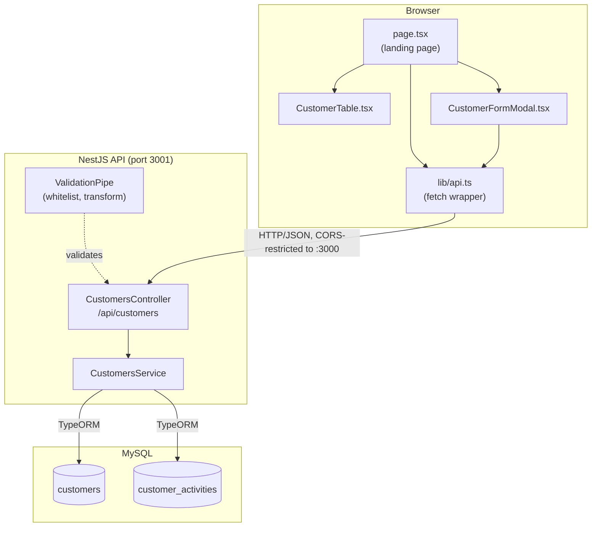

# Architecture

MyCRM is a two-tier application: a NestJS API and a Next.js frontend, talking over HTTP/JSON, backed by a single MySQL database. The split maps directly onto Model-View-Controller, and the mapping below points at real files rather than an aspirational diagram.

## MVC mapping

| Layer | Responsibility | Real files |
|---|---|---|
| **Model** | Data shape, persistence, business rules | [`apps/api/src/customers/customer.entity.ts`](../apps/api/src/customers/customer.entity.ts), [`customer-activity.entity.ts`](../apps/api/src/customers/customer-activity.entity.ts), [`customers.service.ts`](../apps/api/src/customers/customers.service.ts) |
| **Controller** | HTTP routing, request validation, status codes; no business logic | [`customers.controller.ts`](../apps/api/src/customers/customers.controller.ts), DTOs under [`customers/dto/`](../apps/api/src/customers/dto/) |
| **View** | Rendering, user interaction; no direct database access | [`apps/web/app/page.tsx`](../apps/web/app/page.tsx), [`components/CustomerTable.tsx`](../apps/web/components/CustomerTable.tsx), [`components/CustomerFormModal.tsx`](../apps/web/components/CustomerFormModal.tsx) |

The View never talks to MySQL directly; every read or write goes through the API via [`apps/web/lib/api.ts`](../apps/web/lib/api.ts), a thin typed fetch wrapper.

## Component diagram

## Request lifecycle

A typical write request (e.g. `PATCH /api/customers/:id`):

1. **Browser** — a component calls a function in `lib/api.ts` (e.g. `updateCustomer`), which builds the request and throws a typed `ApiError` on any non-2xx response.
2. **NestJS bootstrap** ([`main.ts`](../apps/api/src/main.ts)) has already applied, for every request: a global `/api` prefix, CORS restricted to `http://localhost:3000`, and a global `ValidationPipe` (`whitelist: true, transform: true, forbidNonWhitelisted: true`) that rejects unknown fields and coerces types before a controller method ever runs.
3. **Controller** ([`customers.controller.ts`](../apps/api/src/customers/customers.controller.ts)) receives the validated DTO, does no business logic itself, and calls the matching `CustomersService` method.
4. **Service** ([`customers.service.ts`](../apps/api/src/customers/customers.service.ts)) owns every business rule: duplicate-email checks, the soft-delete/reactivation branching, and activity logging. It talks to MySQL through TypeORM repositories, never raw SQL (except the seed script's `TRUNCATE`/FK-check toggling, which is tooling, not application code).
5. **Response** — the resulting entity (or, for `DELETE`, an empty `204`) flows back through the controller to the browser. `lib/api.ts` either returns the parsed body or throws `ApiError` with the server's status and message(s), which components render inline (form field highlighting, error banners) rather than via a generic error page.

## Ports and environment

| Service | Port | Config |
|---|---|---|
| NestJS API | 3001 | `apps/api/.env` (see `.env.example`) |
| Next.js frontend | 3000 | `apps/web/.env.local` (see `.env.example`) |
| MySQL | 3306 | Homebrew-installed, local only |

The frontend's `NEXT_PUBLIC_API_URL` points at the API; the API's CORS config points back at the frontend. Both are local-only for this phase (see [[07-azure-deployment|Azure deployment]] for the deferred cloud path).

## Future extensions (out of scope for this MVP)

Noted here as the architectural seams where they would attach, not designed in detail:

- **Authentication** — would sit in front of `CustomersController` as a Nest guard; the frontend would need a login flow and a token stored client-side.
- **Orders/products** — would be new entities with a `ManyToOne`/`OneToMany` relation to `Customer`, following the same pattern as `CustomerActivity`.
- **Automatic inactivity detection** — needs a `lastOrderAt` (or similar) field the current model doesn't have, plus a scheduled job or lazy at-read computation; there is no job scheduler in this app yet.
- **Activity trail UI** — the data and endpoint already exist ([`GET /api/customers/:id/activity`](./01-requirements.md)); only the frontend panel is missing.
