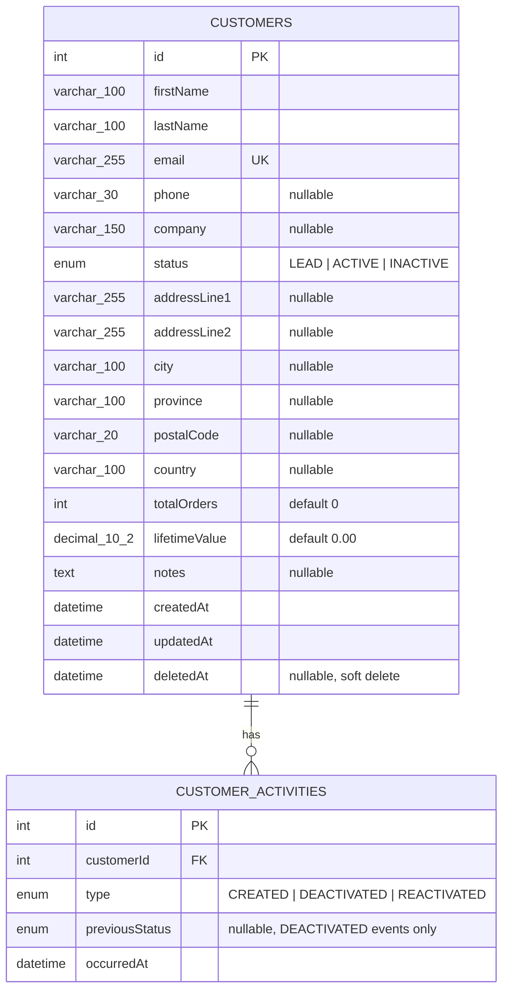

# Entity-Relationship Diagram

Generated from the shipped TypeORM entities ([`customer.entity.ts`](../apps/api/src/customers/customer.entity.ts), [`customer-activity.entity.ts`](../apps/api/src/customers/customer-activity.entity.ts)) and cross-checked against the live schema (`SHOW COLUMNS FROM customers` / `customer_activities` on `crm_poc`), not just the source code.

## Diagram

Deliberately a single business entity plus one supporting audit table: this is the scope decision recorded in [[06-decisions|Decision records]] (no `Order`/`Product`/`User` tables). `customer_activities` was added after the MVP was first scoped, for the reactivation/audit-trail extension in [[01-requirements|Requirements]].

## Data dictionary — `customers`

| Column | Type | Nullable | Default | Notes |
|---|---|---|---|---|
| `id` | `INT` | No | auto-increment | Primary key |
| `firstName` | `VARCHAR(100)` | No | — | Indexed (search, sort) |
| `lastName` | `VARCHAR(100)` | No | — | Indexed (search, sort) |
| `email` | `VARCHAR(255)` | No | — | **Unique index.** Still enforced for soft-deleted rows at the DB level, see [[06-decisions|Decision records]] |
| `phone` | `VARCHAR(30)` | Yes | `NULL` | |
| `company` | `VARCHAR(150)` | Yes | `NULL` | |
| `status` | `ENUM('LEAD','ACTIVE','INACTIVE')` | No | `LEAD` | Indexed. Forced to `INACTIVE` on delete and restored on reactivation, see [[06-decisions|Decision records]] |
| `addressLine1` | `VARCHAR(255)` | Yes | `NULL` | |
| `addressLine2` | `VARCHAR(255)` | Yes | `NULL` | |
| `city` | `VARCHAR(100)` | Yes | `NULL` | |
| `province` | `VARCHAR(100)` | Yes | `NULL` | |
| `postalCode` | `VARCHAR(20)` | Yes | `NULL` | |
| `country` | `VARCHAR(100)` | Yes | `NULL` | |
| `totalOrders` | `INT` | No | `0` | Not settable via the API; managed for future order integration |
| `lifetimeValue` | `DECIMAL(10,2)` | No | `0.00` | Returned as a string by the MySQL driver to avoid float precision loss |
| `notes` | `TEXT` | Yes | `NULL` | |
| `createdAt` | `DATETIME(6)` | No | `CURRENT_TIMESTAMP(6)` | TypeORM-managed. Preserved across a delete/reactivate cycle |
| `updatedAt` | `DATETIME(6)` | No | `CURRENT_TIMESTAMP(6)`, on update | TypeORM-managed |
| `deletedAt` | `DATETIME(6)` | Yes | `NULL` | Soft-delete marker. `NULL` = active |

## Data dictionary — `customer_activities`

| Column | Type | Nullable | Default | Notes |
|---|---|---|---|---|
| `id` | `INT` | No | auto-increment | Primary key |
| `customerId` | `INT` | No | — | Foreign key → `customers.id`, `ON DELETE CASCADE`. Indexed |
| `type` | `ENUM('CREATED','DEACTIVATED','REACTIVATED')` | No | — | One row per event; a customer's full audit trail is every row for its `customerId`, ordered by `occurredAt` |
| `previousStatus` | `ENUM('LEAD','ACTIVE','INACTIVE')` | Yes | `NULL` | Only set on `DEACTIVATED` rows: the customer's `status` immediately before delete forced it to `INACTIVE`. Read back on reactivation to restore it |
| `occurredAt` | `DATETIME(6)` | No | `CURRENT_TIMESTAMP(6)` | TypeORM-managed |

## Indexes

| Table | Index | Purpose |
|---|---|---|
| `customers` | `UNIQUE(email)` | Enforces one active-or-deleted record per email; backs the reactivation logic |
| `customers` | `INDEX(firstName)`, `INDEX(lastName)` | Search and default sort |
| `customers` | `INDEX(status)` | Status filtering (API-level; not currently exposed in the UI) |
| `customer_activities` | `INDEX(customerId)` | Fetching one customer's activity trail |
