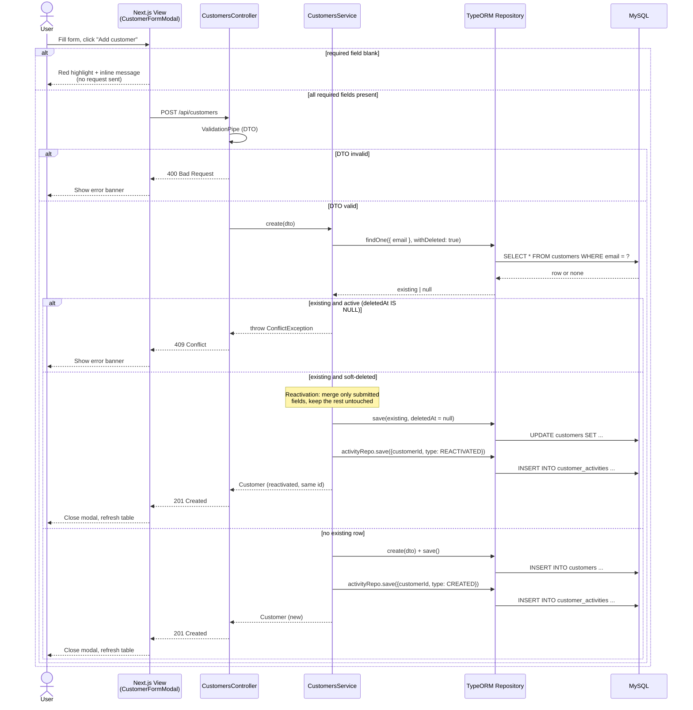
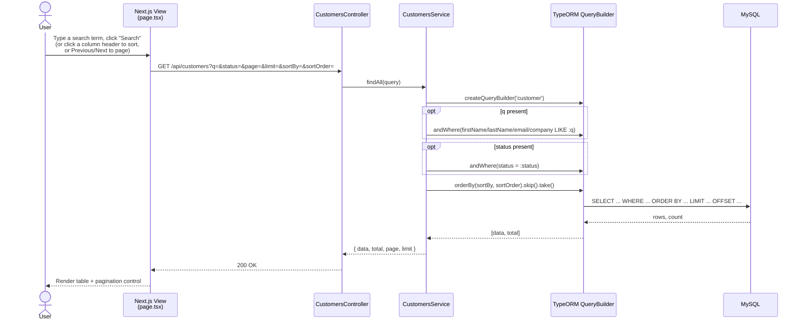
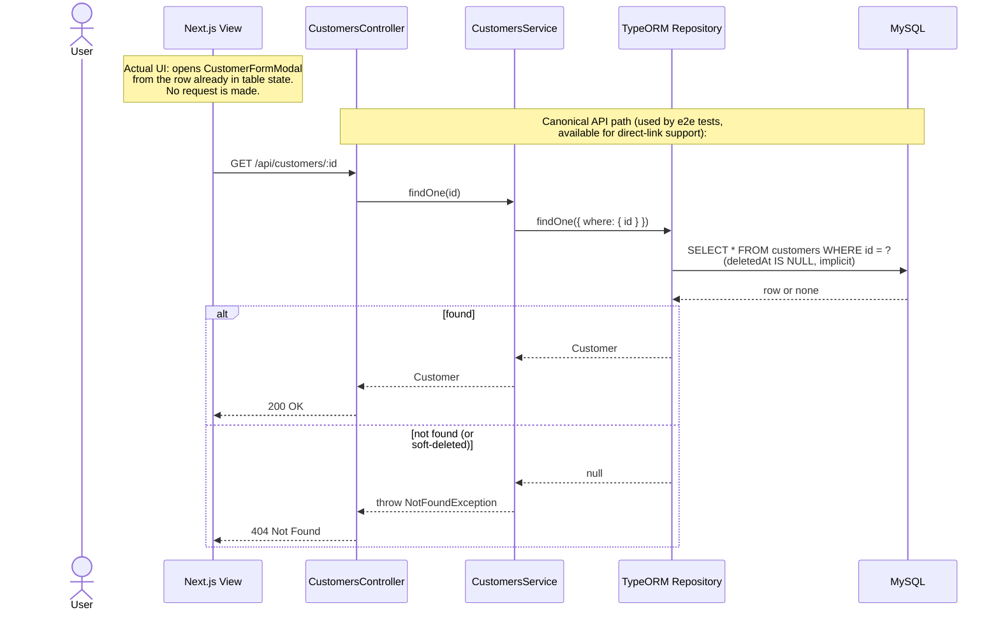
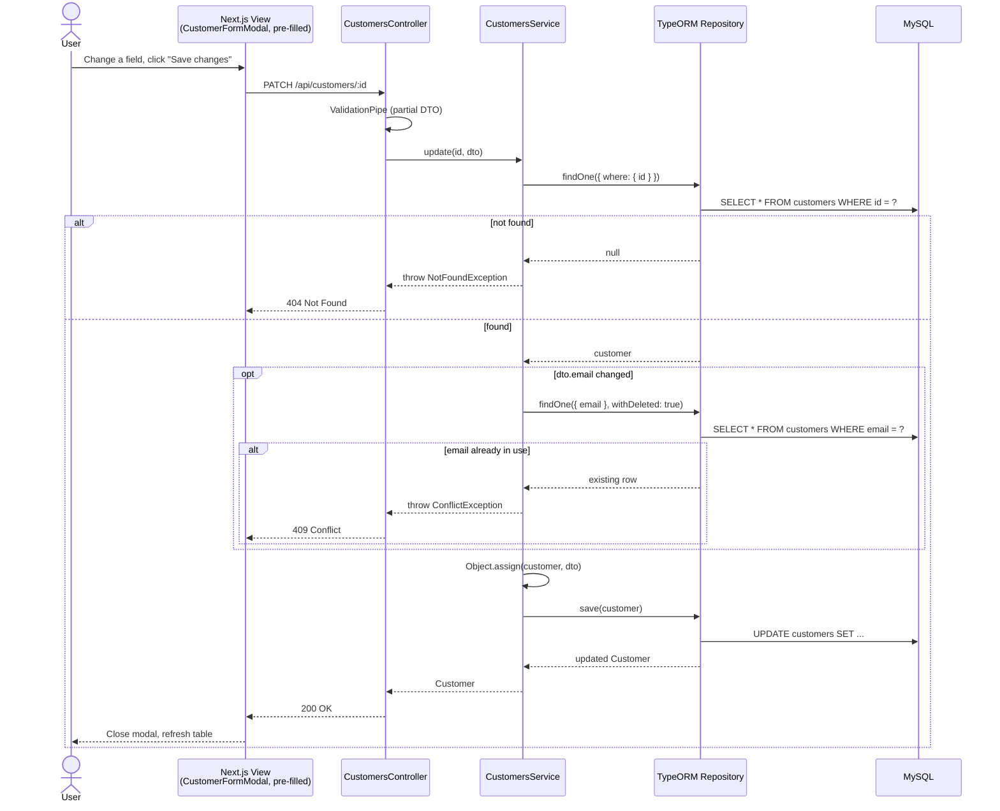
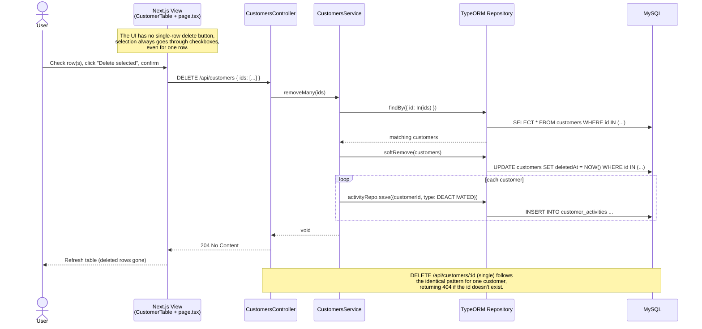
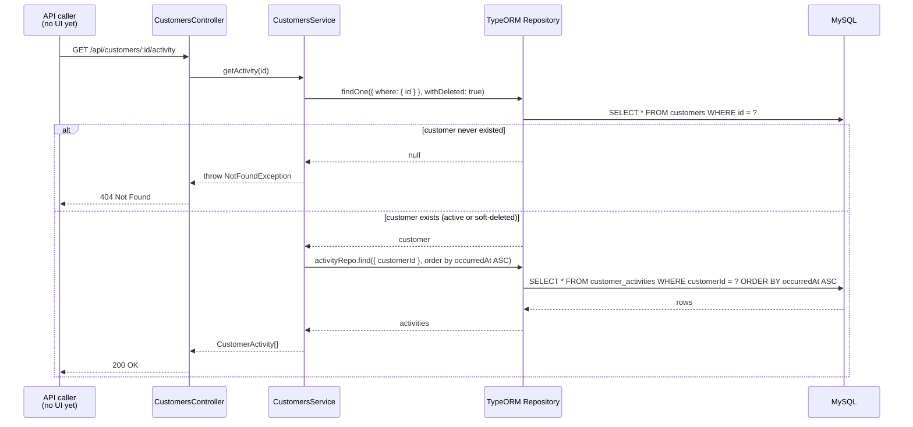

# Sequence Diagrams

One diagram per story, reverse-documented from the actual code paths in [`customers.controller.ts`](../apps/api/src/customers/customers.controller.ts) and [`customers.service.ts`](../apps/api/src/customers/customers.service.ts), including the alternate (error) flows the code actually implements. Where the real UI takes a shortcut against the "canonical" API shape, that's called out rather than smoothed over.

## Add a customer (including reactivation)

This is the one code path (`CustomersService.create`) with three branches: a genuinely new email, an email that belongs to a still-active customer (blocked), and an email that belongs to a soft-deleted customer (reactivated). See [[01-requirements|Requirements]] for the reactivation story.

## Search / list customers

Backs the landing page table, and also what "View" actually relies on in the shipped UI (see the note in the next diagram).

## View a single customer

The API exposes a canonical single-customer fetch, exercised directly by the e2e tests. The shipped UI takes a shortcut against it: clicking a first name opens the edit modal from the row object already held in the table's in-memory state (populated by the Search/List call above), not a fresh request — there's no perceptible loading state for View because of it. The endpoint still exists and matters for any future direct-link consumer.

## Edit a customer

## Delete a customer (single and bulk)

Both routes share the same soft-delete-plus-activity-log pattern; bulk delete repeats it once per selected id.

## Get activity trail (extension)

